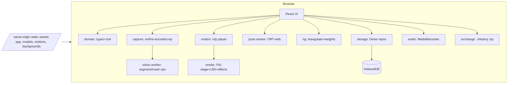

# inkstory — v1 Design

Status: Accepted design for v1 implementation planning
Date: 2026-07-08
Related: ADR-001…ADR-006 (docs/decisions/), research notes (docs/research/), issue plan (docs/ISSUE_PLAN.md)

---

## 1. Product overview

**inkstory** turns a photo of a child's paper drawing into a moving character — the
character keeps the exact look of the drawing — and lets families compose those
characters into narrated, animated picture books. Everything runs in the browser;
**no data ever leaves the device** (ADR-001, ADR-005).

Two core experiences:

1. **Stage mode** — scan one drawing → the character is cut out, rigged, and performs
   motions (dance, walk, wave…) on a chosen background, immediately.
2. **Book mode** — arrange characters into pages, write story text per page, pick (or
   accept a suggested) motion that matches the story beat, record narration, and play
   the book back fullscreen like a bedtime story.

Target release: open-source (MIT), static-hosted PWA + self-hosting guide.

## 2. Requirements decisions and scope

### 2.1 Decisions from product owner (Q&A, 2026-07-07)

| Question | Decision |
|---|---|
| Delivery | **Web app (PWA)** is the MVP; native mobile apps are a v2 planning target |
| "Moving" mechanism | **Skeletal animation + lightweight 2D effects** (AnimatedDrawings method); no generative AI |
| Book scope | Single drawing → auto-animated character preserving the drawing's look; **book mode** makes the character move to match the story |
| Data policy | **Fully local**: no accounts, no telemetry, no cloud AI, nothing leaves the device |

### 2.2 v1 goals

- G1: From a photo (camera or file) to a moving character in under ~2 minutes, with
  correction UIs at each auto step.
- G2: Humanoid drawings get skeletal motion; **any** other drawing still animates via
  effects-mode (no drawing is rejected).
- G3: Books: multi-page, per-page text + motion + optional recorded narration; fullscreen
  kid-friendly playback.
- G4: Works offline after first load (PWA); data survives via explicit `.inkstory`
  export/import backup.
- G5: Ships as auditable OSS with a concrete security/privacy model (§10) and a
  no-network guarantee verified by tests.

### 2.3 v1 non-goals

- No cloud/AI story generation, no TTS (Web Speech deferred; localService-only if ever).
- No multi-character pages, no free character placement (fixed layout, §8.4).
- No video/GIF export; no share links; no sync.
- No accounts, comments, or any social features.
- No quadruped/animal skeleton (effects mode covers those drawings).
- No ARAP deformation (LBS per ADR-003).
- No native mobile apps (v2; scoping issue 29).

### 2.4 Deferred to v2 (tracked in ISSUE_PLAN §7)

Native mobile apps; ARAP; video export; BYO-API-key story generation + consent UX;
local TTS; multi-character scenes; motion editor; additional locales.

### 2.5 Known unknowns

See ISSUE_PLAN §8. The two load-bearing ones: pose-model ONNX conversion outcome
(mitigated by ADR-004 fallback ladder) and LBS visual quality bounds (mitigated by
curated motion ranges, ADR-003).

## 3. Personas and journeys

- **P1 Parent (primary operator)**: photographs the drawing, drives correction steps,
  writes/records story with the child, controls settings and backups.
- **P2 Child (age ~3–9, co-creator/viewer)**: draws on paper; watches; taps through book
  playback; may draw joints with guidance ("put the dot on the hand").
- **P3 Self-hoster/contributor**: deploys the static app; audits privacy claims.

Journey A (first run): open app → sample book plays → "make your own" → capture →
crop → auto mask (+fix) → humanoid? → auto joints (+fix) → preview motion → save →
stage mode.
Journey B (book): new book → add page (pick character, background, type text → motion
suggested, record voice) → repeat → play fullscreen with child.

## 4. System architecture

Static SPA + Web Workers + IndexedDB. No backend (ADR-001).



### 4.1 Module map (source layout)

| Path | Responsibility | Issues |
|---|---|---|
| `src/app/` | shell, routes, providers, error boundary | 03 |
| `src/ui/` | shared components, theme tokens | 03, 26 |
| `src/i18n/` | i18next setup, `ja`/`en` resources | 03 |
| `src/domain/` | entity types, zod schemas, pure logic (COCO mapping, motion suggestion) | 04, 12, 19 |
| `src/storage/` | Dexie db, repositories, blob GC, quota handling | 05 |
| `src/capture/` | acquisition, EXIF-normalizing re-encode, crop/rotate | 06, 07 |
| `src/vision/` | segmentation + mask editing ops (Worker) | 08, 09 |
| `src/pose/` | model loader (hash verify, cache), inference, keypoint decode (Worker) | 11 |
| `src/rig/` | contour extraction, CDT mesh, LBS weights, rig serialization | 13 |
| `src/motion/` | motion JSON loading, clip player, retarget application | 15 |
| `src/render/` | Pixi stage, skinned mesh, effects, backgrounds | 15, 16, 17 |
| `src/book/` | book/page editor state, composer, player | 18, 19, 21 |
| `src/audio/` | narration recorder + playback | 20 |
| `src/exchange/` | export/import `.inkstory` | 22 |
| `src/pwa/` | SW registration, update flow, persistence | 23 |
| `src/diagnostics/` | capability probes (webgpu/coi/storage) | 23, 24 |
| `tools/model-pipeline/` | offline `.mar`→ONNX→quantize + hash manifest | 10 |
| `tools/motion-pipeline/` | offline BVH→motion-JSON converter | 14 |
| `public/models|motions|backgrounds|samples/` | versioned static assets | 10, 14, 16, 25 |

### 4.2 Threading

- Main thread: React, Pixi render loop, LBS skinning (≤3k vertices — cheap).
- `vision.worker`: segmentation and heavy mask ops on `ImageData`/`OffscreenCanvas`.
- `pose.worker`: ORT session creation + inference (keeps model memory off main thread).
- No SharedArrayBuffer requirement; if `crossOriginIsolated`, ORT-web may use threads
  (docs/research/02).

## 5. Character creation pipeline

### 5.1 Wizard state machine

States: `capture → crop → mask → rigType → joints → preview → saved`
(`joints` skipped when `rigType = cutout`). Back-navigation allowed at every step;
leaving the wizard discards the in-memory draft after a confirm dialog.

| State | Input | Output artifact | Auto assist | Manual UI |
|---|---|---|---|---|
| capture | camera/file | original bitmap (memory only) | EXIF orientation fix, downscale ≤2048px, re-encode (strips metadata, ADR-005) | picker UI |
| crop | bitmap | cropped drawing image | — | rect crop + 90° rotate + fine-rotate slider (±15°) |
| mask | drawing image | binary mask + preview cutout | ported `segment()` (§5.2) | brush add/erase, undo/redo (§5.3) |
| rigType | mask confidence + user choice | `humanoid` \| `cutout` | suggest from pose confidence when model present | two-card chooser |
| joints | cutout + mask | 16 joint positions | pose model → COCO-17 → mapping (§5.4); else template pose | drag pins over cutout (§5.5) |
| preview | rig | animated preview (wave clip) | — | accept / go back |
| saved | all | Character persisted (§7) | thumbnail generation | — |

### 5.2 Auto-segmentation (port of AnimatedDrawings `segment()`)

Pure function in `src/vision/segment.ts`, executed in `vision.worker`:
`segment(img: ImageData): Uint8Array /* 0|255 per pixel */`

1. grayscale = per-pixel min(R,G,B)
2. adaptive Gaussian threshold, binary inverse (parameters ported exactly from upstream
   `examples/image_to_annotations.py`, MIT — keep a source-reference comment)
3. morphological close ×2 then dilate ×2, 3×3 rect kernel
4. flood-fill background from seed points along all four edges
5. keep the largest connected component; fill interior holes
6. output mask aligned to input dimensions

Performance budget: ≤2 s for 2048×2048 on a 2020 mid-range phone (Worker).
Failure mode: if the largest component covers <2% or >98% of pixels → show "couldn't
find the drawing" guidance and open the manual brush with an empty/full mask.

### 5.3 Mask editor

Canvas overlay on the drawing: mask tint + marching-ants preview. Tools: brush
add / erase (sizes S/M/L), pan/zoom (pinch + wheel), undo/redo stack (≥20 steps),
"re-run auto" button. Output: final mask + `texture.png` (cutout with alpha,
cropped to mask bbox + 8px padding).

### 5.4 Pose estimation and keypoint mapping

- Model: converted upstream pose model (ADR-004), input = letterboxed cutout crop
  (resolution per model card from issue 10), output = 17 COCO keypoints + confidences.
- `cocoToSkeleton(keypoints) → joints{16}` in `src/domain/pose-mapping.ts`: exact
  formulas ported from upstream `image_to_annotations.py` (neck = shoulder midpoint,
  hip = hip midpoint, root slightly below hip, etc.). Table-driven unit tests with
  fixture keypoint sets.
- Low-confidence rule: if mean keypoint confidence < 0.3 → fall back to template pose
  and inform the user ("adjust the dots").

### 5.5 Joint editor

Cutout displayed with 16 draggable pins connected by the 15 bone lines. Pin labels are
kid-friendly localized names ("right hand" = 「みぎて」). Template pose (fractions of
mask bbox — table in issue 12) prefits pins when no model output exists. Validation
warnings (non-blocking): pin outside mask; limb joints crossing sides. "Reset to
template" always available. This UI is the **guaranteed path** (ADR-004): the wizard
never blocks on model availability.

### 5.6 Rig build

`buildRig(mask, joints, texture) → CharacterRig` in `src/rig/`:

1. contour: marching squares on mask → largest polygon → Douglas-Peucker simplify
   (ε = bboxDiag/300, clamp polygon to 80–400 points)
2. interior Steiner points: square grid, spacing = bboxDiag/40, points strictly inside
   the eroded mask (1px erosion)
3. constrained Delaunay triangulation (`cdt2d`) with contour as constraint edges
4. weights: for every vertex, distance to each of the 15 bone segments;
   `w = 1/(d+ε)⁴` for the two nearest bones, normalized (ADR-003); vertices inside the
   head region (above neck) bind fully to bone `neck`
5. degenerate-input fallback: if CDT fails (self-intersecting contour), rebuild from
   the mask bbox as a uniform grid mesh clipped by the mask
6. output normalized to rig space: origin at `root`, character height (mask bbox
   height) = 1.0, +y down

Budget: ≤1 s; vertex count target 800–3000.

## 6. Animation system

### 6.1 Skeleton

The fixed 16-joint / 15-bone humanoid skeleton verified from upstream
(docs/research/01 table). Bones are identified by their child joint name
(`bone:torso` = hip→torso). Rest pose = the user-confirmed joint layout.

### 6.2 Motion clip format (`public/motions/*.json`)

```jsonc
{
  "schemaVersion": 1,
  "id": "wave",                       // [a-z0-9_]{1,32}
  "name":     { "ja": "てをふる", "en": "Wave" },
  "keywords": { "ja": ["こんにちは", "バイバイ", "あいさつ"], "en": ["hello", "bye"] },
  "category": "greeting",             // idle|locomotion|dance|greeting|emotion|action
  "fps": 30,
  "frameCount": 60,
  "loop": true,
  "rootTranslation": [[0.0, 0.0], ...],          // per frame, character-height units
  "restAngles": { "torso": -90.0, ... },          // clip-space rest global angle, deg
  "frames": { "torso": [-90.0, -88.5, ...], ... } // per-bone per-frame global angle, deg
}
```

Retarget rule (upstream orientation-matching): for bone *b* at frame *f*,
`characterGlobalAngle(b,f) = characterRestAngle(b) + (frames[b][f] − restAngles[b])`.
Joint positions then follow by forward kinematics from `root` using the **character's
own bone lengths**. Root translation is added in character-height units. This keeps the
drawing's proportions untouched — the "looks exactly like the drawing" guarantee.

### 6.3 Motion library (v1 bundle)

Converted offline from upstream BVH (`tools/motion-pipeline/`, issue 14). Initial set
(10 clips): idle_breathe, wave, walk, run, jump, dance_1, dance_2, spin, sit_down,
cheer. Each clip: license/attribution entry in `public/motions/CREDITS.md` (CMU/Rokoko
audit — issue 14), curated to moderate joint ranges (LBS artifact control, ADR-003).

### 6.4 Effects layer (and cutout mode)

Deterministic procedural effects composable over any character
(`src/render/effects/`): `float`, `wiggle`, `bounce`, `drift`, `spin` (transform-level)
and particle overlays `sparkles`, `confetti`, `bubbles`. Each has `intensity ∈ [0,1]`,
seeded PRNG, time-based (no per-frame allocation). **Cutout-rig characters** (non-
humanoid drawings) animate exclusively through these; humanoid characters may layer
them over skeletal motion. `prefers-reduced-motion` forces intensity 0 and disables
particles (§8.6).

### 6.5 Playback engine

`MotionPlayer`: samples clip at render time (interpolate between frames, linear on
angles with shortest-arc), outputs bone global angles → FK → per-bone 2D affine
matrices → CPU LBS into the Pixi mesh vertex buffer. Loop/once modes; `speed ∈
[0.5, 2]`. Budget: 60 fps target / 30 fps floor on Pixel-4a-class (issue 15 gate).

### 6.6 Stage mode

Character on a bundled background (8 original flat-illustration backgrounds, §8.4),
motion picker (thumbnails + localized names), effect toggles, fullscreen button.
Default motion: `idle_breathe` (humanoid) / `float` (cutout).

## 7. Data model and persistence

### 7.1 Entities (zod-validated, `src/domain/`)

| Entity | Fields (all ids are UUIDv4 strings) |
|---|---|
| `Blob` record | `id, mime, data(Blob), size, createdAt` |
| `Drawing` | `id, createdAt, source('camera'\|'file'), imageBlobId, width, height` |
| `Character` | `id, name(≤50 chars), createdAt, updatedAt, rigType('humanoid'\|'cutout'), drawingId, textureBlobId, thumbBlobId, rig(CharacterRig\|null), effectPrefs` |
| `CharacterRig` | `schemaVersion(1), joints{16×[x,y]}, mesh{vertices:number[], triangles:number[]}, weights{boneIndex:number, w:number}[][≤2], meshMethod('cdt'\|'grid'), textureSize[w,h]` |
| `Book` | `id, title(≤100), createdAt, updatedAt, pageOrder(string[])` |
| `Page` | `id, bookId, characterId?, backgroundId, text(≤500), motionId?, effectIds(string[]≤3), narrationBlobId?, narrationMime?, advance('tap'\|'auto'), createdAt, updatedAt` |
| `Settings` | `key, value` (locale, reducedMotion override, kidModeHold, …) |

All schemas `zod.strict()`; every boundary (IndexedDB read, import, motion JSON load)
parses before use. `schemaVersion` on rig + export manifest enables forward migration.

### 7.2 IndexedDB layout (Dexie, db `inkstory`, version 1)

```
blobs:      'id, createdAt'
drawings:   'id, createdAt'
characters: 'id, createdAt, updatedAt, name'
books:      'id, createdAt, updatedAt, title'
pages:      'id, bookId, updatedAt'
settings:   'key'
```

Repository layer (`src/storage/repos/*.ts`) is the only Dexie consumer; UI never touches
Dexie directly. Deletions cascade (character → drawing? no: drawing deleted with its
character; book → pages → narration blobs) and run blob GC: a blob is deleted when no
row references its id (reference scan inside one transaction). Every write path catches
`QuotaExceededError` → global "storage full" dialog (export + cleanup actions).
`navigator.storage.persist()` requested on first save; result shown in settings
(docs/research/03).

### 7.3 Export/import — `.inkstory` bundle (issue 22)

Zip (fflate), layout:

```
manifest.json                      {formatVersion:1, appVersion, exportedAt, characterIds[], bookIds[]}
characters/<id>/character.json     Character + CharacterRig (no blob ids; files below)
characters/<id>/texture.png
characters/<id>/thumb.png
books/<id>/book.json               Book + ordered embedded Pages (audio referenced by path)
books/<id>/audio/<pageId>.bin      narration blob, original container; mime in book.json
```

Import is a **hostile-input parser boundary** (§10.3): caps — zip ≤256 MiB, ≤1000
entries, per-entry declared size ≤64 MiB with decompression-ratio abort, image decode
≤4096×4096 then **re-encode via canvas** (strips anything hidden in the container),
audio ≤20 MiB/page stored as opaque blob, all JSON through `zod.strict()`, entry paths
must match the whitelist patterns above (no traversal, no nested archives). Any
violation → import rejected with a per-entry error report; imports are all-or-nothing
per character/book. `formatVersion > 1` → refuse with "update inkstory" message.

## 8. UI/UX

### 8.1 Routes

| Route | Screen | Issue |
|---|---|---|
| `/` | Library (Characters / Books tabs, empty states, sample content) | 03, 25 |
| `/characters/new` | Creation wizard (§5.1) | 06–12 |
| `/characters/:id` | Stage mode | 16 |
| `/books/:id/edit` | Book editor + page composer | 18, 19 |
| `/books/:id/play` | Book player (fullscreen) | 21 |
| `/settings` | language, storage, data management, diagnostics | 03, 23, 24 |
| `/about` | privacy statement, licenses/credits | 28 |

### 8.2 Book editor

Left: vertical page-thumbnail list, drag-to-reorder, add-page button. Right: page
composer for the selected page — character picker (grid of thumbs), background picker,
text area (≤500 chars, auto font-size), motion picker with **suggestions ranked by
`suggestMotions(text, locale)`** (§8.3) shown first, effect toggles, narration recorder
(§8.5), advance mode toggle. Autosave on every change (debounced 500 ms) — no explicit
save button.

### 8.3 Motion suggestion (story-matched movement)

Pure function `suggestMotions(text, locale, clips) → MotionId[]` in `src/domain/`:
lowercase/NFKC-normalize; `ja`: substring match of each clip keyword against text;
`en`: word-boundary match; score = Σ(matched keyword length); ties → stable order by
clip id; return top 4, else category defaults (`idle_breathe`). Deterministic and
fully offline — this is how "the character moves to match the story" works without AI.
Table-driven unit tests (ja + en fixtures) required (issue 19).

### 8.4 Page layout (fixed, v1)

Single template: background full-bleed; character occupies the central 60% height
band; text in a rounded panel over the bottom 25%; page number dots. No free
positioning (v2). Backgrounds: 8 original, project-created flat illustrations
(CC0-equivalent, committed under `public/backgrounds/`), plus 4 plain colors.

### 8.5 Narration recording

Per page: record (MediaRecorder, mono), stop, play, re-record, delete. Live level
meter during recording. Mic permission requested only on the first record tap (user
gesture), with a pre-permission explainer. Store output blob + `mimeType` as produced
by the browser (codec matrix in docs/research/03); max length 60 s/page.

### 8.6 Book player (kid mode)

Fullscreen; wake lock; per page: motion loops, narration plays once; advance = tap
anywhere (default) or auto (narration end + 1 s; 6 s when silent). Page-turn: 300 ms
slide. Exit: hold the corner button 1 s (accident-proofing). Honors
`prefers-reduced-motion` (§6.4). No external links, no dialogs inside kid mode.

### 8.7 i18n & a11y

i18next; `ja` default, `en` complete at release; all strings externalized (CI check —
issue 03). Parent-facing screens: WCAG 2.1 AA contrast, visible focus, labeled inputs,
keyboard operability. Kid-facing: touch targets ≥48 px (player controls ≥64 px), no
flashing content >3 Hz, audio never autoplays outside the player.

## 9. PWA, offline, performance

### 9.1 Service worker

`vite-plugin-pwa` (Workbox): precache app shell (JS/CSS/HTML/backgrounds/motions);
runtime cache-first for `/models/**` in a dedicated versioned cache with progress UI
on first fetch. Update flow: waiting-SW toast "新しいバージョン" → apply on confirm;
never auto-reload during wizard/editor/player.

### 9.2 Install & durability

Install promotion card (per-platform instructions; iOS = Add to Home Screen);
`navigator.storage.persist()`; storage usage meter (`estimate()`); eviction warning
banner when un-persisted on WebKit (docs/research/03).

### 9.3 Cross-origin isolation strategy

Optional enhancement only (docs/research/02): `_headers` for CF Pages/Netlify,
`coi-serviceworker` for GitHub Pages, plain single-thread otherwise. Diagnostics
screen shows `crossOriginIsolated`, WebGPU availability, chosen ORT EP.

### 9.4 Performance budgets (CI-checked where possible)

| Metric | Budget |
|---|---|
| Initial JS (app shell, gz) | ≤300 KB (Pixi/ORT lazy-chunked) |
| Pose model | ≤30 MB target, 60 MB cap (issue 10) |
| Segmentation (2048², worker) | ≤2 s mid-range phone |
| Rig build | ≤1 s |
| Stage/player frame rate | 60 fps target, 30 fps floor (Pixel-4a-class) |
| Wizard step transition | ≤3 s each |

## 10. Security & privacy model

### 10.1 Assets to protect

A1 children's drawings/photos (may capture faces/rooms/EXIF-GPS before stripping);
A2 narration audio (children's voices); A3 story text; A4 device storage integrity;
A5 the app's supply chain & served artifacts (what users actually execute).

### 10.2 Trust boundaries

| # | Boundary | Direction |
|---|---|---|
| B1 | Camera/microphone → app | device capability |
| B2 | User-selected files (images) → app | hostile input |
| B3 | `.inkstory` import → app | **hostile input (files shared between strangers)** |
| B4 | IndexedDB / Cache Storage | persistence |
| B5 | Static asset fetch (JS/wasm/models) | served artifacts |
| B6 | Service-worker update channel | code delivery |
| B7 | npm deps / GitHub Actions | supply chain |
| B8 | Hosting configuration (headers, TLS) | deployment |

### 10.3 Threats and controls (v1 mandatory)

| Threat | Boundary | Control | Issue |
|---|---|---|---|
| EXIF GPS / hidden metadata persisted or exported | B2 | decode→re-encode every image at import; originals never stored | 06 |
| Malicious image (decoder abuse, huge dims) | B2/B3 | browser decodes (sandboxed) + dimension caps + re-encode | 06, 22 |
| Zip bomb / resource exhaustion | B3 | size/entry/ratio caps, streaming abort | 22 |
| Path traversal / smuggled entries in bundle | B3 | whitelist path grammar, no nested archives, ignore unknown entries | 22 |
| Stored XSS via story text / titles / imported JSON | B3/B4 | React text rendering only (no `dangerouslySetInnerHTML` — lint-enforced), `zod.strict()` at every parse, CSP backstop | 04, 22, 24 |
| Malicious "motion"/"rig" JSON (NaN/huge arrays → hang) | B3 | numeric range + array-length bounds in schemas | 04, 22 |
| Tampered/corrupted model or wasm asset | B5 | same-origin only + sha256 manifest verified before session; SRI for static tags where applicable | 11, 24 |
| SW/update poisoning via compromised host | B6/B8 | minimized+pinned deps, lockfile, pinned-by-SHA Actions, protected main, deploy via reviewed workflow only | 02, 24, 28 |
| Dependency compromise (postinstall, typosquat) | B7 | pnpm `ignore-scripts=true`, `pnpm audit` CI gate (fail=high), Dependabot, dependency-budget review rule | 02, 24 |
| Mic/camera surprise activation | B1 | permissions requested only on explicit user gesture with explainer; no background use; streams stopped on step exit | 06, 20 |
| Data loss (eviction/quota) | B4 | persist(), quota dialogs, export-first UX | 05, 23 |
| Cross-site leakage | B8 | CSP `connect-src 'self'`; **E2E test fails on any cross-origin request** | 24, 27 |

### 10.4 Content-Security-Policy (target; minimized in issue 24)

`default-src 'self'; script-src 'self' 'wasm-unsafe-eval'; style-src 'self';
img-src 'self' blob: data:; media-src blob:; connect-src 'self'; worker-src 'self' blob:;
object-src 'none'; base-uri 'none'; form-action 'none'; frame-ancestors 'none'`
Delivered as headers where the host allows, `<meta http-equiv>` fallback otherwise.

### 10.5 Abuse cases (design responses)

- A stranger shares a crafted `.inkstory` file in a parents' chat group → B3 controls;
  import UI shows exactly what will be added before committing.
- A curious child mashes buttons → destructive actions behind explicit confirm dialogs
  naming the target; player exit requires 1 s hold; no purchases/links anywhere.
- A fork operator adds tracking → privacy statement + docs make the no-network
  guarantee testable (`pnpm test:privacy`), so forks are auditable against upstream.

### 10.6 Secure defaults & policy

Everything is off-by-default: no network beyond same-origin assets, no telemetry
hooks, no experimental flags. New runtime dependencies require an ADR note (ADR-006).
`SECURITY.md` defines private vulnerability reporting (GitHub advisories) — issue 28.

## 11. Distribution & hosting

- Reference deployment: GitHub Pages via Actions workflow (build → artifact → deploy,
  OIDC, pinned actions) + `coi-serviceworker` (issue 28).
- Self-hosting guide: any static server; header matrix from docs/research/03; HTTPS
  required for camera/mic/SW.
- Versioning: semver tags; CHANGELOG (Keep-a-Changelog); release = tag + Pages deploy
  (merge ≠ release).

## 12. Testing & validation strategy

| Layer | Tooling | Scope (gates in CI) |
|---|---|---|
| Unit | Vitest | pure modules: segment (fixture images → mask IoU ≥0.9 vs goldens), COCO mapping, weights, suggestion, schemas, exporter/importer, motion sampling |
| Component | Testing Library | wizard step logic, editors' state |
| Storage | fake-indexeddb | repos, cascade+GC, quota paths |
| E2E | Playwright (chromium+webkit) | golden path: fixture image → character → stage; book create → play; import fixture + **malicious-bundle rejection suite**; **network audit (zero cross-origin)** |
| Perf | Playwright trace + fps probe | budgets §9.4 smoke on CI (chromium) |
| Security | lint rules + audit gate + CSP check | §10.3 controls |

Fixtures: ≥6 original drawing photos (humanoid ×4 incl. faint pencil + colored marker,
non-humanoid ×2) committed under `tests/fixtures/` (project-created, no third-party
children's art).

## 13. Top risks

| Risk | Mitigation |
|---|---|
| Pose model conversion fails/too big | ADR-004 ladder; spike issue 10 timeboxed; manual path ships regardless |
| LBS visual quality disappoints | curated clips (14), preview step (wizard), ARAP deferred |
| iOS storage eviction loses data | §9.2 mitigations + export-first UX |
| cdt2d degenerate failures | grid-mesh fallback (§5.6) |
| Segmentation quality on busy photos | crop step + manual brush are first-class |
| Scope creep in book mode | fixed layout template, single character/page (v2 items) |
