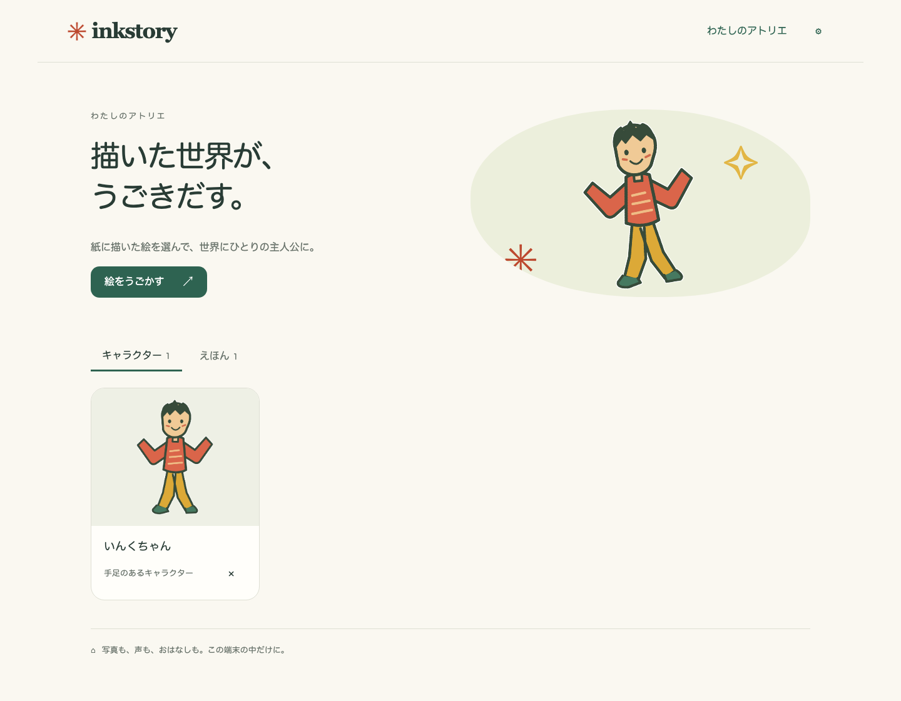
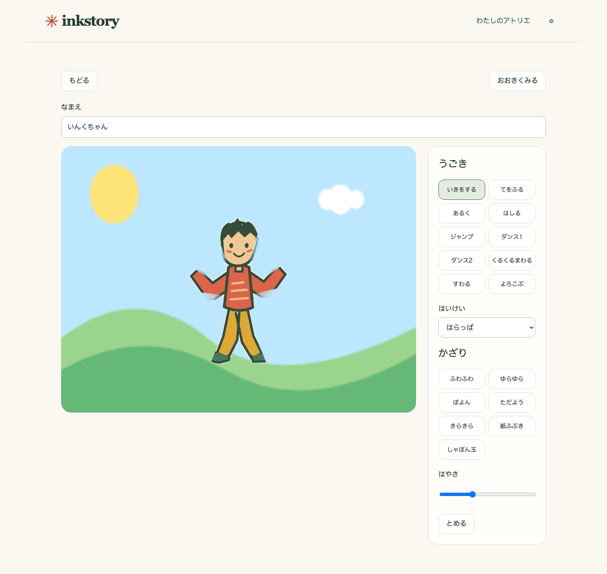

# 保護者向けガイド

inkstory は最新のブラウザで使います。絵を準備している間はタブを閉じないでください。初回アクセスではアプリ本体と同梱素材を取得し、次回以降のオフライン動作はブラウザの service worker キャッシュに依存します。

## キャラクターを作る

1. ライブラリで「キャラクターを作る」を選び、カメラ写真または画像ファイルを取り込みます。ブラウザ内で撮影するときだけカメラを許可します。
2. 光を均一にし、濃い影を避け、紙を無地の背景に置きます。絵が画面いっぱいになるようにしつつ少し余白を残してください。濃い輪郭と紙との明るさの差があると背景を分けやすくなります。
3. 「切り抜き」で四角形を動かして絵を囲みます。向きが違うときは 90 度回転を使い、必要なら微調整します。絵全体が正しい向きで見えてから進みます。
4. 「マスク」では背景を自動で取り除いた色付きプレビューを確認します。ブラシは絵を追加し、消しゴムは不要部分を除きます。失敗したら undo、細部は拡大・移動を使い、写真の範囲を変えたときは自動マスクを再実行します。足、髪、細い線、腕や脚の間を確認してください。
5. 人のような体で骨格の動きを使いたいときは「Humanoid」を選びます。16 個の点は補助の初期値です。動物、物、または骨格にしにくい絵には「Cutout」を選ぶと、絵全体をエフェクト付きで動かせます。
6. Humanoid では頭・首、肩、ひじ、手、腰、ひざ、足の点を絵の関節へドラッグします。迷ったら「テンプレートに戻す」を使います。マスクの外にある点は警告なので、絵の上へ戻してください。
7. 動きをプレビューし、輪郭や手足の曲がり方が気になるときはマスクまたは関節へ戻って直してから保存します。

姿勢モデルは補助機能です。モデルがない、遅い、使えない場合もテンプレートと手動の点設定で進められます。姿勢を得るために写真をアップロードすることはありません。

## ステージと絵本

保存したキャラクターを開くとステージです。背景と同梱の動きを選んで再生します。「新しい本」ではページを追加し、1 ページにつきキャラクター 1 体、背景、500 文字以内の文章、動きを設定します。ページ送りはタップまたは自動を選べます。ナレーションはマイクを許可して録音、停止、再生確認してから保存します。録音は 60 秒または 20 MiB が上限で、キャンセルするとマイクを解放します。

プレイヤーを全画面にして読み聞かせに使えます。MVP は文章や音声をサーバーへ送らず、クラウドの読み上げも行いません。

## バックアップと移行

「設定」で保存したいキャラクターや本を選び「エクスポート」を押します。ブラウザのデータを消す前や端末を変える前に `.inkstory` ファイルを安全な場所へ保存してください。戻すときは「インポート」でプレビューを確認してから確定します。壊れた形式、許可されないパス、サイズ超過、PNG や音声の制限違反は取り込みません。

現在のエクスポートにはキャラクターのメタデータ・rig JSON・texture/thumbnail PNG、本とページの JSON、ナレーション音声が入ります。元の写真はエクスポート前の存在確認だけで、アーカイブには入りません。元写真も必要な場合は別に保管してください。

## 困ったとき

- **カメラやマイクを拒否した:** ブラウザのサイト権限で許可し、再読み込みして試します。開発中の localhost 以外では HTTPS が必要です。既存画像を選び、ナレーションを使わずに進むこともできます。
- **絵が消えた、紙が残った:** 明るさとコントラストを整え、自動マスクを再実行してからブラシで追加・消去します。人型でも難しいときは Cutout にできます。
- **動きで大きく曲がった:** テンプレートへ戻し、見えている関節へ点を置き直して再生します。細い線や離れた絵は Cutout が適しています。
- **保存容量の警告が出た、作品が見えない:** すぐにエクスポートします。「設定」で永続ストレージを依頼し、使用量表示も確認します。ブラウザのデータは利用者が消去でき、端末の空き容量が少ないと消えることがあります。バックアップが端末をまたぐ持ち運び用コピーです。
- **姿勢モデルが使えない、通信が遅い:** テンプレートと手動の関節で続行します。モデルはキャラクター作成に必須ではありません。
- **更新のお知らせが出た:** 作業を保存またはエクスポートしてから更新を受け入れ、再読み込みします。更新でアプリ本体のキャッシュは入れ替わりますが、IndexedDB のデータは端末内に残ります。

## スクリーンショット

2026-09-08 に production build をデスクトップ Chromium で撮影しました。同梱のオリジナル作品を使った画面です。実機のカメラ・マイク確認は別途必要です。

